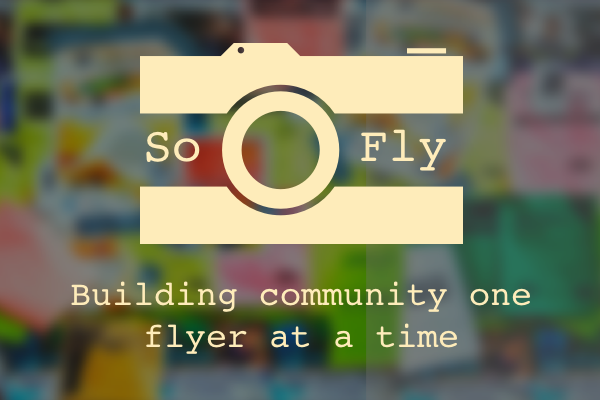

### HackPrinceton Spring 2017 - 2nd Place for Best Princeton App

### Video Demo:
<iframe src="https://player.vimeo.com/video/211174699" width="100%" height="500" frameborder="0" webkitallowfullscreen mozallowfullscreen allowfullscreen></iframe>

<a href="https://vimeo.com/211174699">SoFly Scanner - Demo</a> from <a href="https://vimeo.com/user40150632">Kevin Hou</a> on <a href="https://vimeo.com">Vimeo</a>.

## Inspiration
The motivation for our application came when we realized how much our college uses flyers to advertise events. From dance recitals, to scientific talks, events are neatly summarized and hung on campus in visible areas. A huge part of our sense of community comes from these events, and as excursions into Princeton township have shown us, events planned in non-centralized communities rely on flyers and other written media to communicate activities to others.
Both of us have fond memories attending community events growing up, and we think (through some surveying of our student body) that a cause of decreased attendance at such events is due to a few factors. (1) People forget. Its not a flyer they can always take with them, and so what they think is instantaneously exciting soon fades from their memory. (2) It is not digital – in a world where everything else is.

## What it does
Our vision is an application that can allow a user to snap a picture of a flyer, and have their phone extract relevant information, and make a calendar event based on that. This will allow users to digitize flyers, and hopefully provide a decentralized mechanism for communities to grow close again.

## How I built it
Our application uses Optical Character Recognition techniques (along with Otsu’s method to preprocess a picture, and an exposure and alignment adjustment algorithm) to extract a dump of recognized text. This text is error prone, and quite messy, and so we use canonical Natural Language Processing algorithms to tokenize the text, and “learn” which terms are important. The Machine Learning component in this project involves a Naive Bayesian Classifier, which can categorize and weight these terms for (as of now) internal use. This compared with a “loose NFA” implementation (we coined the term to describe an overly general regex with multiple matches) whose matches were processed using an algorithm that determined the most probable match. From the flyers we extract date, time, location, and our best guess at the title of the text.  We made a design choice to limit the time our OCR took, which leads to worse holistic text recognition, but still allows us to extract theses fields using our NLP methods.

## Challenges I ran into
There were a ton of challenges working on this. Optical Character Recognition, Machine Learning, and Natural Language Processing are all open fields of research, and our project drew on all of them. The debugging process was brutal, especially since given their nature, bad input would mess up even the best written code.

## Accomplishments that I'm proud of
This was an ambitious project, and we brought it to the finish line. We are both very proud of that.

## What I learned
Team chemistry is a huge part of success. If my partner and I were any less compatible this would definitely not have worked.

## What's next for SoFly Scanner
We need more time to train our ML algorithm, and want to give it a wider geographic functionality. Additionally, we want to incorporate more complex image processing techniques to give our OCR the best chance of success!

